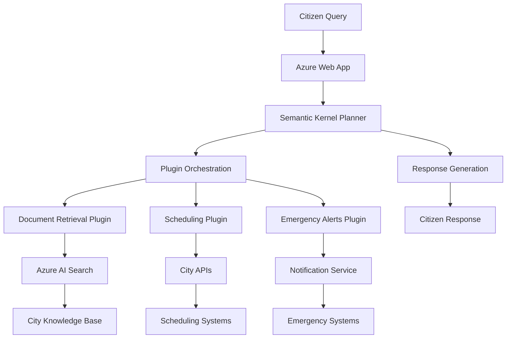
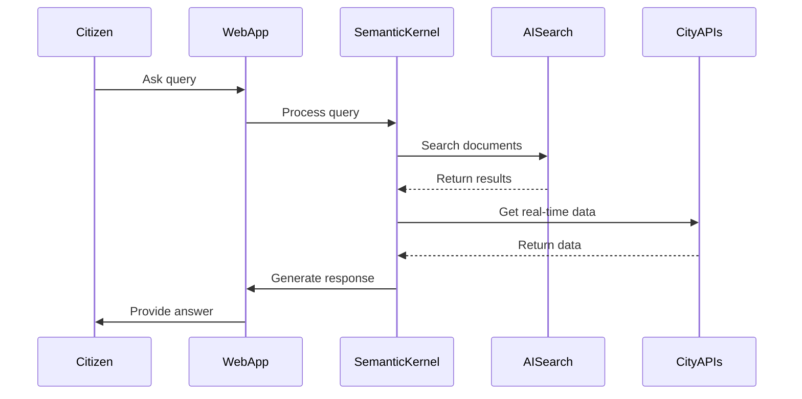
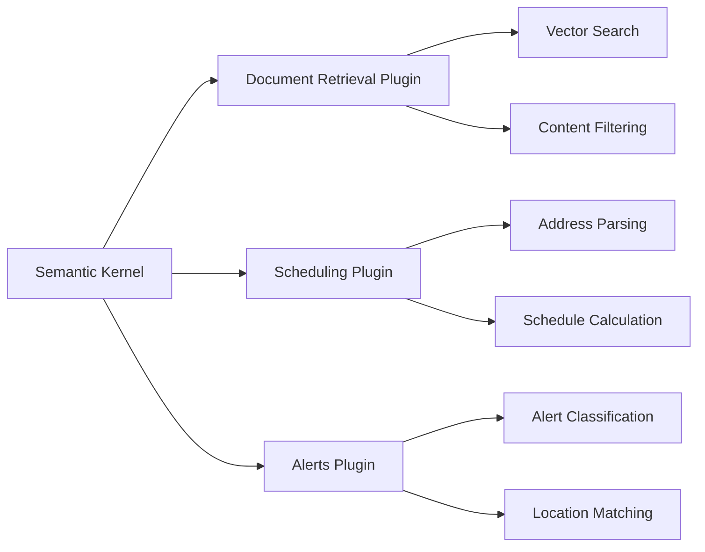
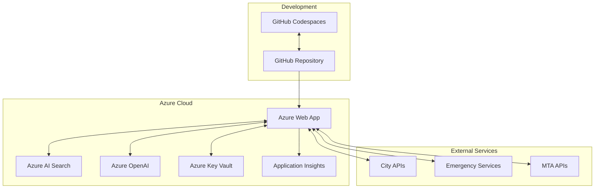

# Virtual Citizen Assistant - Architecture Overview

## System Architecture Diagram

## Component Flow Diagram

## Plugin Architecture

## Deployment Architecture

This architecture ensures:
- **Scalability**: Azure Web App can scale based on demand
- **Security**: All secrets managed through Azure Key Vault
- **Monitoring**: Application Insights for performance tracking
- **Flexibility**: Plugin-based architecture for easy extensions
- **Reliability**: Multiple fallback mechanisms for service continuity